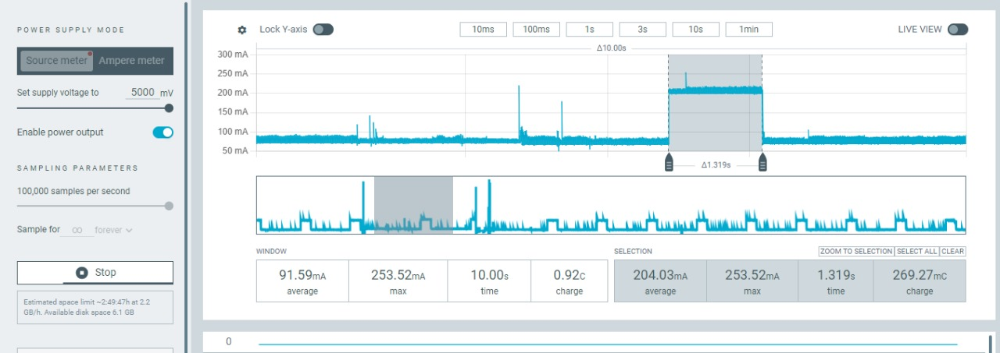

<div align="center">

# 📡 PAIC — Avaliação de Tecnologias de Comunicação Sem Fio
## para Embarcação Movida a Energia Solar


[]()
[]()
[]()
[]()

</div>

---

## 📑 Índice

- [Sobre o Projeto](#-sobre-o-projeto)
- [Contextualização](#-contextualização)
- [Cronograma e Relatórios Mensais](#-cronograma-e-relatórios-mensais)
- [Arquitetura do Sistema](#-arquitetura-do-sistema)
- [Hardware](#-hardware)
- [Protocolo de Comunicação LoRa](#-protocolo-de-comunicação-lora)
- [Protocolo de Comunicação SIM7000G](#-protocolo-de-comunicação-sim7000g)
- [Estrutura do Código](#-estrutura-do-código)
- [Dashboard e Visualização](#-dashboard-e-visualização)
- [Resultados e Conclusões](#-resultados-e-conclusões)
- [Apresentação Final — ENAEPE](#-apresentação-final--enaepe)
- [Como Executar](#-como-executar)
- [Galeria](#-galeria)
- [Informações do Projeto](#-informações-do-projeto)

---

## 🚤 Sobre o Projeto

Este repositório documenta a pesquisa e o desenvolvimento realizados durante o **Programa de Iniciação Científica e Tecnológica (PAIC/FAPEAM)**, vinculado à **Escola Superior de Tecnologia (EST)** da **Universidade do Estado do Amazonas (UEA)**.

O projeto nasceu da necessidade real da **Equipe Leviatã** — equipe de competição de embarcações solares da UEA — de possuir um sistema de telemetria confiável durante as provas do **Desafio Solar Brasil**. Sem telemetria, a equipe em terra não tem acesso ao estado da bateria, posição GPS ou eficiência do sistema solar durante a prova, prejudicando diretamente a estratégia de corrida.

O objetivo central da pesquisa foi **comparar tecnologias de comunicação sem fio** para determinar qual delas é mais adequada ao ambiente fluvial amazônico, considerando alcance, confiabilidade, consumo energético e custo.

---

## 🌎 Contextualização

### O Desafio Solar Brasil

O **Desafio Solar Brasil** é uma competição universitária em que equipes desenvolvem embarcações movidas exclusivamente a energia solar e competem em provas de resistência e velocidade em rios. A competição exige que as equipes monitorem em tempo real:

- **Posição e velocidade** da embarcação (GPS)
- **Estado das baterias** (tensão e corrente)
- **Produção dos painéis solares** (via controlador MPPT)

### O Problema do Ambiente Fluvial Amazônico

O ambiente de operação apresenta desafios únicos para comunicação sem fio:

| Desafio | Impacto |
|---|---|
| Rios largos com margens arborizadas | Obstrução do sinal (NLOS) |
| Cobertura celular variável nas margens | Inconsistência do SIM7000G |
| Orçamento limitado de energia (solar) | Consumo do módulo é crítico |
| Distâncias de até 3 km da equipe de apoio | Exige longo alcance |

### Tecnologias Avaliadas

| Tecnologia | Módulo | Padrão | Frequência |
|---|---|---|---|
| **LoRa** | Heltec LoRa32 (SX1276) | IEEE 802.15.4g | 915 MHz (Brasil) |
| **Rede Celular** | SIM7000G | LTE-M / Cat-M1 / NB-IoT | 700–2100 MHz |

---

## 📅 Cronograma e Relatórios Mensais

O projeto foi executado ao longo de **6 meses** (fevereiro a julho de 2024–2025), com entrega de relatório mensal ao programa PAIC/FAPEAM. Cada mês correspondeu a uma etapa específica do desenvolvimento.

| Mês | Etapa | Relatório |
|---|---|---|
| **Fevereiro** | Revisão bibliográfica, estudo das tecnologias LoRa e LTE-M, levantamento de componentes | [📄 Relatório Fevereiro](./resumo%20mensal/Relatório%20mensal%20ICT%202024%202025(fevereiro).docx) |
| **Março** | Montagem dos protótipos em protoboard, primeiros testes de comunicação LoRa ponto-a-ponto | [📄 Relatório Março](./resumo%20mensal/Relatório%20mensal%20ICT%202024%202025(março).docx) |
| **Abril** | Integração do GPS NEO-6M, leitura do protocolo VE.Direct do MPPT, desenvolvimento do pacote de telemetria | [📄 Relatório Abril](./resumo%20mensal/Relatório%20mensal%20ICT%202024%202025(abril).docx) |
| **Maio** | Testes de campo urbano (NLOS), medição de alcance e perda de pacotes LoRa, início dos testes SIM7000G | [📄 Relatório Maio](./resumo%20mensal/Relatório%20mensal%20ICT%202024%202025(maio).docx) |
| **Junho** | Testes fluviais, medição de consumo energético (multímetro), desenvolvimento da dashboard Node-RED | [📄 Relatório Junho](./resumo%20mensal/Relatório%20mensal%20ICT%202024%202025(junho).docx) |
| **Julho** | Consolidação dos resultados, análise comparativa final, elaboração do banner e relatório final | [📄 Relatório Julho](./resumo%20mensal/Relatório%20mensal%20ICT%202024%202025(julho).docx) |

📋 **Relatório Final Consolidado:** [Relatório ICT 2024–2025](./resumo%20mensal/Relatório%20mensal%20ICT%202024%202025.docx)

### Progressão do Desenvolvimento

```
Fev ──► Mar ──────► Abr ──────────► Mai ──────────► Jun ──────► Jul
 │         │              │               │              │          │
Estudo   Protótipo     GPS + MPPT     Testes       Testes     Resultados
biblio.  protoboard    integrados     urbanos      fluviais   + Banner
         LoRa p2p      VE.Direct      NLOS 1,6km   Consumo    ENAEPE
```

---

## 🏗️ Arquitetura do Sistema

O sistema foi desenvolvido em duas arquiteturas paralelas, uma para cada tecnologia avaliada.

### Arquitetura LoRa (Sistema Principal)

```
┌─────────────────────────────────────────────────────────────┐
│                    EMBARCAÇÃO (Sender)                      │
│                                                             │
│  GPS NEO-6M ──serial──► ESP32 LoRa32 ◄──serial── MPPT      │
│                              │                   (VE.Direct)│
│                         OLED Display                        │
│                         Buzzer                              │
│                              │                              │
│                         LoRa SX1276                         │
│                         915 MHz / SF12 / 20dBm              │
└─────────────────────────────┬───────────────────────────────┘
                              │  Rádio LoRa (até 1,6+ km NLOS)
                              ▼
┌─────────────────────────────────────────────────────────────┐
│                    BASE EM TERRA (Receiver)                  │
│                                                             │
│              LoRa SX1276 ──► ESP32 LoRa32                   │
│                                   │                         │
│                         ┌─────────┼──────────┐              │
│                         ▼         ▼          ▼              │
│                    NeoPixel    OLED       WiFi               │
│                    (RSSI)   (Dashboard) (Gateway)            │
│                                          │                  │
│                                     Broker MQTT             │
│                                   (Mosquitto público)        │
│                                          │                  │
│                                     Node-RED                │
│                                  (Dashboard web/mobile)     │
└─────────────────────────────────────────────────────────────┘
```

### Arquitetura SIM7000G (Sistema Comparativo)

```
┌─────────────────────────────────────────────────────────────┐
│                    EMBARCAÇÃO (All-in-one)                   │
│                                                             │
│  MPPT ──serial──► ESP32 ◄──I2C── OLED Display              │
│                     │                                       │
│               SIM7000G (LTE-M)                              │
│               GPS integrado                                 │
│                     │                                       │
│              Rede Celular (Claro)                           │
│              APN: claro.com.br                              │
└──────────────────────┬──────────────────────────────────────┘
                       │  Internet (LTE-M/NB-IoT)
                       ▼
              Broker MQTT público
              (test.mosquitto.org)
                       │
              Node-RED / Blynk / Firebase
              (Dashboard remoto)
```

---

## 🔧 Hardware

### Módulo Transmissor LoRa (Sender — Embarcação)

| Componente | Modelo | Função |
|---|---|---|
| Microcontrolador + Rádio | **Heltec LoRa32 V2** (ESP32 + SX1276) | Processamento e transmissão LoRa |
| GPS | **NEO-6M** | Geolocalização (lat/lon/velocidade) |
| Display | **OLED SSD1306** 128×64 | Dashboard local do piloto |
| Buzzer | Piezoelétrico 5V | Alertas sonoros de inicialização/erro |
| Alimentação | Conversor Buck 12V → 5V | Alimentado pela bateria da embarcação |
| Interface MPPT | Serial UART (VE.Direct 19200 bps) | Leitura dos dados do controlador solar |

#### Pinout — Sender (Heltec LoRa32)

```
SPI (LoRa SX1276):
  SCK  → GPIO 5
  MISO → GPIO 19
  MOSI → GPIO 27
  SS   → GPIO 18
  RST  → GPIO 14
  DIO0 → GPIO 26

I2C (OLED SSD1306):
  SDA  → GPIO 4
  SCL  → GPIO 15
  RST  → GPIO 16

Serial (GPS NEO-6M):
  RX_GPS → GPIO 34  (HardwareSerial 1)
  TX_GPS → GPIO 16

Serial (MPPT VE.Direct):
  RX_MPPT → GPIO 36  (HardwareSerial 2, somente leitura)
  Baud    → 19200 bps

Buzzer:
  BUZZ → GPIO 23
```

---

### Módulo Receptor LoRa (Receiver — Base em Terra)

| Componente | Modelo | Função |
|---|---|---|
| Microcontrolador + Rádio | **Heltec LoRa32 V2** (ESP32 + SX1276) | Recepção LoRa e gateway MQTT |
| Display | **OLED SSD1306** 128×64 | Velocímetro / dashboard em tempo real |
| Anel de LEDs | **NeoPixel WS2812B** 16 LEDs | Indicador visual de qualidade do sinal (RSSI) |
| Conexão | WiFi 2.4 GHz (ESP32 interno) | Gateway para broker MQTT |

#### Pinout — Receiver (Heltec LoRa32)

```
SPI (LoRa SX1276):  idêntico ao Sender

I2C (OLED SSD1306):
  SDA  → GPIO 4
  SCL  → GPIO 15
  RST  → GPIO 16

NeoPixel:
  DATA → GPIO 13
  LEDs → 16 unidades (WS2812B)
```

#### Mapeamento RSSI → NeoPixel

| Faixa RSSI | LEDs | Cor |
|---|---|---|
| -120 a -90 dBm | 1 a 5 | 🔴 Vermelho (sinal fraco) |
| -90 a -70 dBm | 6 a 10 | 🟡 Amarelo (sinal médio) |
| -70 a -50 dBm | 11 a 16 | 🟢 Verde (sinal forte) |

---

### Módulo SIM7000G (Embarcação — Sistema Celular)

| Componente | Modelo | Função |
|---|---|---|
| Microcontrolador | **ESP32** | Processamento |
| Modem | **SIM7000G** | LTE-M / NB-IoT / GPS integrado |
| Display | **OLED SSD1306** 128×32 | Dashboard local |
| Interface MPPT | Serial UART 19200 bps | Dados do controlador solar |
| Operadora | Claro Brasil | APN: `claro.com.br` |

#### Pinout — SIM7000G

```
UART (SIM7000G):
  TX → GPIO 27
  RX → GPIO 26
  DTR → GPIO 25
  PWR → GPIO 4  (acionamento de energia)

LED indicador:
  LED → GPIO 12

Serial (MPPT):
  RX_MPPT → GPIO 34  (somente leitura)
```

---

## 📡 Protocolo de Comunicação LoRa

### Configurações do Rádio

| Parâmetro | Valor | Justificativa |
|---|---|---|
| Frequência | **915 MHz** | Faixa ISM homologada pela Anatel para o Brasil |
| Spreading Factor | **SF12** | Máximo alcance — melhor sensibilidade (-137 dBm) |
| Potência TX | **20 dBm** (100 mW) | Potência máxima permitida para a faixa |
| Largura de banda | 125 kHz (padrão) | Equilíbrio entre taxa e sensibilidade |
| Biblioteca | `LoRa.h` (Sandeep Mistry) | Compatível com SX1276 |

> **Nota sobre SF12:** O Spreading Factor 12 proporciona a maior sensibilidade do SX1276, mas também a menor taxa de dados (~293 bps). Para os pacotes de telemetria da Leviatã (~50 bytes), isso resulta em um tempo de envio de ~2,7 segundos por pacote — adequado para atualizações a cada 2 segundos.

### Formato do Pacote de Telemetria

O pacote LoRa é uma **string CSV** (valores separados por vírgula) transmitida em texto puro:

```
<contador>,<latitude>,<longitude>,<tensao_bat>,<corrente_bat>,<tensao_painel>,<potencia_painel>
```

**Exemplo real:**
```
42,-3.118700,-60.021500,48.35,12.450,52.10,642.3
```

| Campo | Tipo | Unidade | Fonte |
|---|---|---|---|
| `contador` | `int` | — | Contador incremental de pacotes |
| `latitude` | `double` | ° (6 casas decimais) | GPS NEO-6M |
| `longitude` | `double` | ° (6 casas decimais) | GPS NEO-6M |
| `tensao_bat` | `float` | V (2 casas) | MPPT VE.Direct (`V` / 1000) |
| `corrente_bat` | `float` | A (3 casas) | MPPT VE.Direct (`I` / 1000) |
| `tensao_painel` | `float` | V (2 casas) | MPPT VE.Direct (`VPV` / 1000) |
| `potencia_painel` | `float` | W (1 casa) | MPPT VE.Direct (`PPV`) |

> Se o GPS não tiver sinal, os campos de coordenada são substituídos por `0,0`.

### Leitura do MPPT (Protocolo VE.Direct)

O protocolo **VE.Direct** da Victron Energy transmite dados em texto via serial a **19200 bps** no formato:

```
<LABEL>\t<VALOR>\r\n
```

Os campos lidos e suas conversões:

| Label | Dado | Divisor | Unidade |
|---|---|---|---|
| `V` | Tensão da bateria | ÷ 1000 | V |
| `I` | Corrente da bateria | ÷ 1000 | A |
| `VPV` | Tensão do painel solar | ÷ 1000 | V |
| `PPV` | Potência do painel solar | — | W |

### Tópicos MQTT Publicados pelo Receiver

O receiver publica os dados nos seguintes tópicos do broker `test.mosquitto.org:1883`:

| Tópico MQTT | Conteúdo | Exemplo |
|---|---|---|
| `Lora32/gps` | `"latitude,longitude"` | `"-3.118700,-60.021500"` |
| `Lora32/TensaoBat` | Tensão da bateria (V) | `"48.35"` |
| `Lora32/CorrenteBat` | Corrente da bateria (A) | `"12.45"` |
| `Lora32/TensaoPV` | Tensão do painel (V) | `"52.10"` |
| `Lora32/PotenciaPV` | Potência do painel (W) | `"642.3"` |
| `Lora32/rssi` | RSSI do último pacote (dBm) | `"-87"` |
| `Lora32/pacote` | Número do pacote | `"42"` |

### Monitoramento de Perda de Pacotes

O receiver implementa contagem de pacotes perdidos comparando o `contador` do pacote recebido com o último recebido:

```cpp
if (contador == lastPacketReceived + 1) {
    packetCountReceived++;                         // Pacote sequencial OK
} else if (contador > lastPacketReceived + 1) {
    packetCountLost += (contador - lastPacketReceived - 1); // Pacotes pulados
}
```

---

## 📶 Protocolo de Comunicação SIM7000G

### Configuração do Modem (TinyGSM)

```cpp
#define TINY_GSM_MODEM_SIM7000
// APN Claro Brasil
const char apn[]      = "claro.com.br";
const char gprsUser[] = "claro";
const char gprsPass[] = "claro";
// Modo de rede
modem.setNetworkMode(48); // GSM + LTE Only (sem WCDMA)
```

### Leitura de GPS Integrado

O SIM7000G possui GPS interno, ativado via comandos AT:

```cpp
modem.sendAT("+CGPIO=0,48,1,1"); // Liga o GPS
modem.enableGPS();
float lat, lon, speed;
modem.getGPS(&lat, &lon, &speed);
```

### Tópicos MQTT (SIM7000G)

| Tópico MQTT | Conteúdo |
|---|---|
| `node-red/gps/latitude` | Latitude (4 casas decimais) |
| `node-red/gps/longitude` | Longitude (4 casas decimais) |
| `node-red/gps/velocidade` | Velocidade (km/h) |
| `node-red/mppt/CorrenteBat` | Corrente da bateria (A) |
| `node-red/mppt/TensaoBat` | Tensão da bateria (V) |
| `node-red/mppt/TensaoPAINEL` | Tensão do painel (V) |
| `node-red/mppt/Potencia` | Potência do painel (W) |
| `node-red/Qsinal` | Qualidade do sinal celular (0–31) |

---

## 📁 Estrutura do Código

```
Codigos/
│
├── lora32-sender-mppt-gps/          # V1.0 — Transmissor LoRa (versão inicial)
├── lora32-sender-mppt-gpsV2_0/      # V2.0 — Transmissor LoRa (versão final com buzzer e logo)
│
├── lora32-receiver-mppt-gps/        # V1.0 — Receptor LoRa (versão inicial)
├── lora32-receiver-mppt-gpsV2_0/    # V2.0 — Receptor LoRa (versão final com NeoPixel e MQTT)
│
├── mqqt-sim7000g/                   # Transmissor celular principal (LTE-M + GPS + MPPT + MQTT)
├── gps-sim7000g/                    # Experimento isolado: GPS via SIM7000G
├── enviar_comando_at_para_o_sim7000g/ # Utilitário: passthrough AT commands para debug
│
├── sim7000g-blynk/                  # Alternativa: integração com plataforma Blynk IoT
├── sim7000g-blynk-oled/             # Alternativa: Blynk + OLED
├── sim7000g-blynk-wifi/             # Alternativa: Blynk com fallback WiFi
├── sim7000g-firebase/               # Alternativa: integração com Firebase Realtime Database
│
├── LORA32/                          # Testes unitários do módulo LoRa
├── exemplo_mqtt/                    # Exemplo básico de publish/subscribe MQTT
└── teste_mqqt/                      # Testes de conectividade MQTT
```

### Descrição dos Arquivos Principais

| Arquivo | Versão | Descrição técnica |
|---|---|---|
| `lora32-sender-mppt-gpsV2_0.ino` | **V2.0 Final** | Lê GPS (HardwareSerial 1) e MPPT (HardwareSerial 2), monta pacote CSV, transmite via LoRa a cada 2 s. Inclui logo Leviatã em bitmap no OLED e buzzer de inicialização. |
| `lora32-receiver-mppt-gpsV2_0.ino` | **V2.0 Final** | Recebe pacote LoRa, faz parse CSV, atualiza OLED, mapeia RSSI no NeoPixel (3 zonas de cor), publica 7 tópicos MQTT via WiFi. |
| `mqqt-sim7000g.ino` | **Final** | Usa TinyGSM + PubSubClient para conectar via APN Claro, lê GPS integrado do SIM7000G, lê MPPT via serial, publica 8 tópicos MQTT via LTE-M. Inclui reconexão automática. |
| `sim7000g-firebase.ino` | Alternativo | Envia dados direto para Firebase Realtime Database (sem MQTT), útil para rastreamento histórico com timestamp. |
| `sim7000g-blynk.ino` | Alternativo | Dashboard mobile via aplicativo Blynk, sem necessidade de servidor próprio. |

### Loop Principal — Sender LoRa V2.0

```
loop():
  1. lerDadosMPPT()        → lê Serial2 (VE.Direct): V, I, VPV, PPV
  2. Coleta GPS             → lê HardwareSerial1 via TinyGPS++
  3. Monta pacote CSV       → "contador,lat,lon,vBat,iBat,vPanel,pPanel"
  4. LoRa.beginPacket()
     LoRa.print(pacote)
     LoRa.endPacket()      → transmite o pacote (~2,7 s no ar com SF12)
  5. atualizarDisplay()     → atualiza OLED com todos os dados
  6. counter++
  7. delay(2000)            → próxima transmissão
```

### Loop Principal — Receiver LoRa V2.0

```
loop():
  1. mqttClient.loop()      → mantém conexão MQTT ativa
  2. LoRa.parsePacket()     → verifica se há pacote recebido
  3. Se pacote recebido:
     a. Lê string LoRa
     b. rssi = LoRa.packetRssi()
     c. updateRssiBar(rssi) → mapeia -120..-50 dBm nos 16 LEDs NeoPixel
     d. processarDados()    → parse CSV, conta pacotes perdidos
     e. publicarDadosMQTT() → publica 7 tópicos
     f. atualizarDisplay()  → OLED com GPS + energia
```

---

## 📊 Dashboard e Visualização

### Node-RED (Dashboard Principal)

O Node-RED consome os tópicos MQTT e gera uma dashboard web acessível por qualquer dispositivo na mesma rede:


**Fluxo Node-RED:**
```
[MQTT In: Lora32/gps]      → [Parse lat/lon] → [Mapa / GPS Widget]
[MQTT In: Lora32/TensaoBat] → [Gauge: Tensão]
[MQTT In: Lora32/CorrenteBat] → [Gauge: Corrente]
[MQTT In: Lora32/PotenciaPV] → [Chart: Potência]
[MQTT In: Lora32/rssi]      → [Gauge: Qualidade do Sinal]
[MQTT In: Lora32/pacote]    → [Counter: Pacotes Recebidos]
```


### Dashboard Mobile (Blynk — Alternativo)

Como alternativa ao Node-RED, foi desenvolvida uma versão com **Blynk IoT**, acessível via aplicativo mobile sem necessidade de servidor próprio:


### Display OLED — Sender (Piloto na Embarcação)

```
┌──────────────────────────────┐
│ TELEMETRIA LEVIATA           │
│ Pacote: 42                   │
│ Lat: -3.118700               │
│ Lon: -60.021500              │
│ Bat: 48.35V  12.45A         │
│ Painel: 52.1V  642.3W       │
└──────────────────────────────┘
```

---

## 📈 Resultados e Conclusões

### Tabela Comparativa Final

| Critério | LoRa (SX1276) | SIM7000G (LTE-M) | Vencedor |
|---|---|---|---|
| **Alcance urbano NLOS** | Até **1,6 km** estável | Dependente da cobertura | 🏆 LoRa |
| **Confiabilidade fluvial** | **< 10%** perda de pacotes | Instável nas margens | 🏆 LoRa |
| **Consumo em operação** | **~200 mA** | **~300 mA** (+50%) | 🏆 LoRa |
| **Custo do módulo** | **~R$ 80** (LoRa32) | **~R$ 120** (SIM7000G) | 🏆 LoRa |
| **Custo operacional** | Gratuito (ISM) | Chip + plano de dados | 🏆 LoRa |
| **Alcance máximo teórico** | **+10 km** (LoS) | Cobertura da operadora | 🏆 LoRa |
| **Independência de infraestrutura** | **Total** | Depende de torres celulares | 🏆 LoRa |
| **Taxa de dados** | ~293 bps (SF12) | Vários Mbps | 🏆 SIM7000G |
| **Facilidade de setup** | Moderada | Complexa (AT commands) | 🏆 LoRa |

### Análise Detalhada

#### Alcance e Propagação

Os testes em área urbana de Manaus-AM (ambiente NLOS — sem linha de visada direta) demonstraram que o LoRa com SF12 manteve comunicação estável até **1,6 km** de distância. Em ambiente aberto com linha de visada (como no rio), o alcance estimado ultrapassa **5 km**, muito acima do necessário para as provas do Desafio Solar Brasil.

O SIM7000G apresentou comportamento imprevisível em função da variação de cobertura celular nas margens dos rios. Em certas localidades, a embarcação pode navegar por trechos sem cobertura 4G/LTE-M, tornando a telemetria intermitente justamente nos momentos mais críticos da prova.

#### Consumo Energético

Com uma embarcação que opera exclusivamente a energia solar, cada miliampere conta:

```
Economia com LoRa:
  SIM7000G em operação:  ~300 mA × 5h prova = 1.500 mAh
  LoRa em operação:      ~200 mA × 5h prova = 1.000 mAh
  Economia:               500 mAh por prova  (~33% de redução)
```

Essa economia representa energia extra disponível para a propulsão, podendo impactar diretamente o desempenho competitivo.

#### Confiabilidade do Protocolo

O protocolo LoRa apresentou taxa de entrega de pacotes superior a **90%** nos testes fluviais, com perda de pacotes concentrada em momentos de obstrução física (embarcação passando sob pontes ou por curvas fechadas do rio). O SIM7000G apresentou desconexões completas por períodos de dezenas de segundos durante a navegação.

### Conclusão

A tecnologia **LoRa com o módulo LoRa32 (SX1276)** foi eleita como a solução mais adequada para o sistema de telemetria da Equipe Leviatã, sendo adotada como tecnologia principal nas temporadas seguintes. O SIM7000G permanece como referência para cenários onde a cobertura celular é garantida e onde há necessidade de transmissão de grandes volumes de dados.

---

## 🎓 Apresentação Final — ENAEPE

Ao final do programa, os resultados da pesquisa foram apresentados no **ENAEPE — Encontro de Atividades de Pesquisa Científica e Extensão** da UEA, na forma de **banner científico**.

| | |
|---|---|
| **Evento** | ENAEPE — Encontro de Aprendizagem e Pesquisa Científica e Extensão |
| **Formato** | Banner científico (A0, formato vertical) |
| **Arquivo** | [📄 Banner ENAEPE — ICT (PDF)](./ANEXO%202%20-%20Modelo%20banner%20ENAEPE%20-%20ICT.pdf) |
| **Seções do banner** | Introdução · Objetivos · Metodologia · Resultados · Conclusão · Referências |

### Estrutura do Banner Científico

O banner seguiu a estrutura padrão exigida pelo PAIC/FAPEAM/ENAEPE:

```
┌─────────────────────────────────────────────────────┐
│          LOGOTIPOS (UEA · EST · FAPEAM)              │
├─────────────────────────────────────────────────────┤
│   Avaliação de Tecnologias de Comunicação Sem Fio   │
│     para Embarcação Movida a Energia Solar 🚤☀️     │
│         Elias H. L. Cunha · Prof. Moisés P. Bastos  │
├──────────────┬──────────────────────────────────────┤
│  INTRODUÇÃO  │           RESULTADOS                 │
│              │  LoRa: 1,6 km · < 10% perda          │
│  OBJETIVOS   │  SIM7000G: instável em margens        │
│              │  Consumo: LoRa 200mA vs 300mA         │
│ METODOLOGIA  ├──────────────────────────────────────┤
│              │          CONCLUSÃO                    │
│  Protótipos  │  LoRa superior para telemetria         │
│  ESP32+LoRa  │  fluvial em embarcações solares       │
│  SIM7000G    ├──────────────────────────────────────┤
│  Testes NLOS │         REFERÊNCIAS                   │
└──────────────┴──────────────────────────────────────┘
```

---

## 🚀 Como Executar

### Pré-requisitos

- **Arduino IDE** 2.x ou **PlatformIO**
- Placa **Heltec LoRa32** adicionada ao gerenciador de placas
- Para SIM7000G: chip SIM com plano de dados Claro (APN `claro.com.br`)

### Instalação das Bibliotecas (Arduino IDE)

Instale via **Gerenciador de Bibliotecas**:

| Biblioteca | Versão testada | Uso |
|---|---|---|
| `LoRa` (Sandeep Mistry) | ≥ 0.8.0 | Comunicação LoRa SX1276 |
| `TinyGPS++` | ≥ 1.0.3 | Parsing do GPS NEO-6M |
| `TinyGsmClient` | ≥ 0.11.7 | Modem SIM7000G |
| `PubSubClient` | ≥ 2.8 | Cliente MQTT |
| `Adafruit GFX Library` | ≥ 1.11 | Gráficos para OLED |
| `Adafruit SSD1306` | ≥ 2.5 | Driver OLED |
| `Adafruit NeoPixel` | ≥ 1.12 | Anel de LEDs WS2812B |

### Configuração e Upload

#### 1. Sistema LoRa — Sender

```cpp
// Em lora32-sender-mppt-gpsV2_0.ino, verifique:
#define BAND 915E6        // Frequência 915 MHz (Anatel Brasil)
LoRa.setSpreadingFactor(12);  // SF12 para máximo alcance
LoRa.setTxPower(20);          // 20 dBm
```

Grave na placa **transmissora** (na embarcação).

#### 2. Sistema LoRa — Receiver

```cpp
// Em lora32-receiver-mppt-gpsV2_0.ino, configure:
const char* ssid = "NOME_DA_SUA_REDE";
const char* password = "SENHA_DA_SUA_REDE";
const char* mqttServer = "test.mosquitto.org"; // ou seu broker privado
```

Grave na placa **receptora** (na base em terra).

#### 3. Sistema SIM7000G

```cpp
// Em mqqt-sim7000g.ino, configure a APN conforme sua operadora:
const char apn[]      = "claro.com.br";
const char gprsUser[] = "claro";
const char gprsPass[] = "claro";
```

#### 4. Dashboard Node-RED

1. Instale o Node-RED: `npm install -g node-red`
2. Instale o pacote de dashboard: `npm install node-red-dashboard`
3. Importe o fluxo configurando os nós MQTT para subscrever aos tópicos `Lora32/#`
4. Acesse: `http://localhost:1880/ui`

---

## 🖼️ Galeria

### Hardware

| | | |
|---|---|---|
|  |  |  |
| *Sender em protoboard* | *Sender em operação* | *Receiver montado* |

| | | |
|---|---|---|
|  |  |  |
| *Módulo SIM7000G* | *Medição de consumo LoRa* | *Medição de consumo SIM7000G* |

### Case 3D

| | | |
|---|---|---|
|  | .png) | .png) |
| *Case — Vista frontal* | *Case — Vista lateral* | *Case — Vista explodida* |

### Dashboard e Testes

| | |
|---|---|
|  |  |
| *Node-RED — Dados em tempo real* | *Node-RED — Integração MPPT* |

---

## 📋 Informações do Projeto

| Campo | Informação |
|---|---|
| **Autor** | Elias Hitle Lima Cunha |
| **Matrícula** | ehlc.eai22@uea.edu.br |
| **Orientador** | Prof. Moisés Pereira Bastos |
| **Programa** | PAIC — Programa de Aprendizagem e Iniciação Científica |
| **Financiador** | FAPEAM — Fundação de Amparo à Pesquisa do Estado do Amazonas |
| **Instituição** | Escola Superior de Tecnologia (EST) |
| **Universidade** | Universidade do Estado do Amazonas (UEA) |
| **Equipe** | Leviatã UEA |
| **Competição** | Desafio Solar Brasil |
| **Período** | 2024–2025 |

---

<div align="center">

Desenvolvido com 💚 em Manaus, Amazônas.

**Equipe Leviatã · UEA · FAPEAM**

[](https://www.instagram.com/leviatauea/)

</div>
