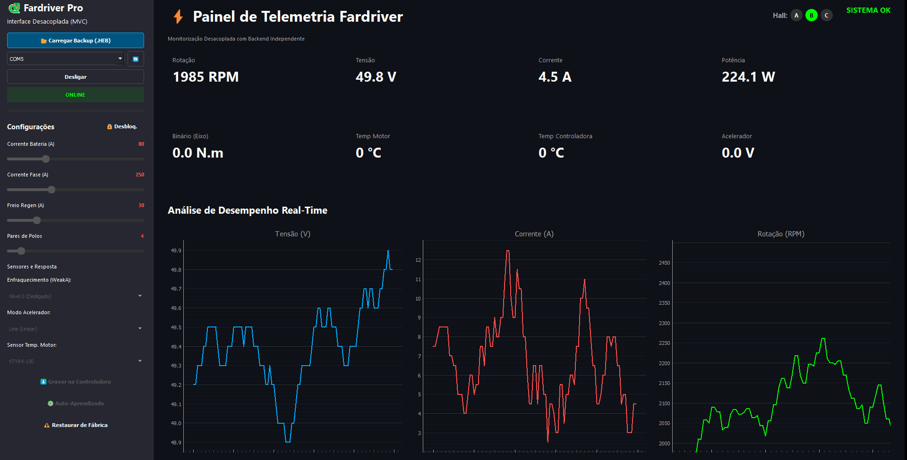

# ⛵ Telemetria 2026 - Comunicação Fardriver 🔋


Bem-vindo ao diretório de **Telemetria (Temporada 2026)** da **Equipe Leviatã (UEA)**.

Este repositório centraliza todo o **ecossistema de software desenvolvido para aquisição de dados do veículo**, com foco na comunicação serial com o controlador **Fardriver** (arquitetura ND72450).

O sistema evoluiu de scripts experimentais para uma **aplicação estruturada com dashboard em tempo real e geração de relatórios offline**, permitindo acompanhar parâmetros críticos do motor durante testes de bancada e competições como o **Desafio Solar Brasil**.

---

# 📊 Dashboard & Relatórios

A aplicação possui uma **interface gráfica em tempo real** otimizada para alto desempenho, capaz de gravar até **1 hora de dados contínuos na memória RAM** sem travamentos.



## 📄 Relatórios Offline de Engenharia

Além do monitoramento ao vivo, o sistema conta com um **Gerador de Relatórios Web (.html)**.

Com um clique, os dados do teste são exportados para um documento interativo (usando **Chart.js**), exibindo:

- Picos absolutos de **Corrente e RPM**
- Médias e picos de **Temperatura (Motor e Controladora)**
- Gráficos trifásicos (**RPM, Amperes, Volts**) separados para análise de desempenho

---

# 🏗️ Arquitetura do Sistema

A arquitetura do sistema segue o padrão **MVC (Model-View-Controller) modificado**, dividida em camadas principais:

```text
Fardriver Controller
        │
        │ Serial (19200 bps)
        │
USB-TTL Adapter
        │
        │
Python Application
        │
 ├── Fardriver Serial (Comunicação UART / Keep-Alive / Checksum)
 ├── Heb Parser (Decodificador de Backups Fardriver)
 ├── Report Generator (Montagem de HTML offline com Chart.js)
 └── Dashboard UI (Frontend em PyQt5 + PyQtGraph)
```

---

# 📁 Estrutura do Diretório

O projeto está dividido entre a **versão consolidada da aplicação** e **scripts de prototipagem**.

## 📦 Fardriver_pro/

Núcleo do sistema pronto para execução e distribuição.

```text
Fardriver_pro/
│
├── main.py                 # Ponto de entrada da aplicação
├── fardriver_serial.py     # Gerencia comunicação serial e bytes de comando
├── heb_parser.py           # Decodifica arquivos .HEB da Fardriver
├── report_generator.py     # Lógica visual da geração de relatórios
├── ui_dashboard.py         # Interface gráfica e telemetria
├── logo.png                # Logotipo da UI e relatórios
│
└── dist/                   # Executável gerado com PyInstaller
```

---

## 🧪 Scripts de Prototipagem

Experimentos realizados durante o desenvolvimento do dashboard:

- `Fardriver_matplotlib.py`
- `Fardriver_PyQtGrafs.py`
- `fardriver_streamlit.py`
- `Fardriver.py` *(primeiras tentativas de leitura serial)*

---

# ⚙️ Tecnologias Utilizadas

Para garantir **leveza e velocidade na leitura de dados (10Hz)**:

- **Linguagem:** Python 3.8+
- **Interface Gráfica:** PyQt5
- **Gráficos em Tempo Real:** PyQtGraph *(substituindo Matplotlib para maior FPS)*
- **Gráficos de Relatório:** Chart.js *(injeção via HTML)*
- **Comunicação:** PySerial *(USB-TTL)*

## 📡 Estrutura do Protocolo Fardriver

- **Pacotes de telemetria (receção):**  
  `0xAA | Header | Dados (12 bytes) | CRC16 (2 bytes)`
- **Comandos legados (envio de keep‑alive, etc.):**  
  `0xAA | CMD | ~CMD | Sub | Val1 | Val2 | Checksum | ~Checksum`
- **Escrita moderna de parâmetros:**  
  usa endereçamento direto com flags e CRC16 (implementado em `fardriver_serial.py`).

---

## 🛠️ Funcionalidades

- [x] Leitura ao vivo de **RPM, Corrente, Tensão e Potência**
- [x] Monitoramento térmico (**Motor e MOSFET**)
- [x] Gráficos com **janela deslizante de 10 s** e histórico completo em RAM para exportação
- [x] Gerador de **Relatório HTML** (imprimível como PDF)
- [x] **Coleta de dados de aceleração** (2048 amostras na flash)
- [x] **Histórico de erros** da sessão
- [x] Ajuste e envio de parâmetros (**Corrente, Polos, Throttle, WeakA, PID, tabelas de ratio**)
- [x] Comandos de manutenção (**Auto‑Learn, Cancelar Learn, Factory Reset**)
- [x] Leitura de arquivos de backup **`.HEB`**
- [x] Exportação de dados para **CSV**
- [x] Guardar e carregar **perfis de configuração** (JSON)

---

# 📦 Instalação (Para Desenvolvedores)

Certifique-se de ter o Python instalado.

```bash
pip install pyserial PyQt5 pyqtgraph pyinstaller
```

---

# 🔌 Conexão com o Controlador

Use um adaptador **USB-TTL (RS485/UART)**.

O cruzamento dos cabos é fundamental:

```text
TX (Fardriver)  -> RX (PC)
RX (Fardriver)  -> TX (PC)
GND (Fardriver) -> GND (PC)
```

---

# ▶️ Execução e Compilação

## 1️⃣ Modo Desenvolvimento

```bash
cd Telemetria_2026/Fardriver_pro
python main.py
```

## 2️⃣ Gerar Executável (Standalone)

Para criar a versão final `.exe`:

```bash
pyinstaller --noconsole --onefile --add-data "logo.png;." main.py
```

O executável final estará em:

```text
dist/
```

---

# 👨‍🔧 Equipe

**Elias Cunha**  
Gênio da bola — Equipe Leviatã

📧 ehlc.eai22@uea.edu.br  
📸 Instagram: @leviatauea

---

# 🌿 Sobre a Equipe Leviatã

A **Equipe Leviatã (UEA)** desenvolve tecnologias voltadas à **mobilidade sustentável**, participando de competições como o **Desafio Solar Brasil**, promovendo inovação tecnológica e engenharia de ponta na Amazônia.

---

⭐ Desenvolvido com foco em **engenharia, inovação e sustentabilidade**
