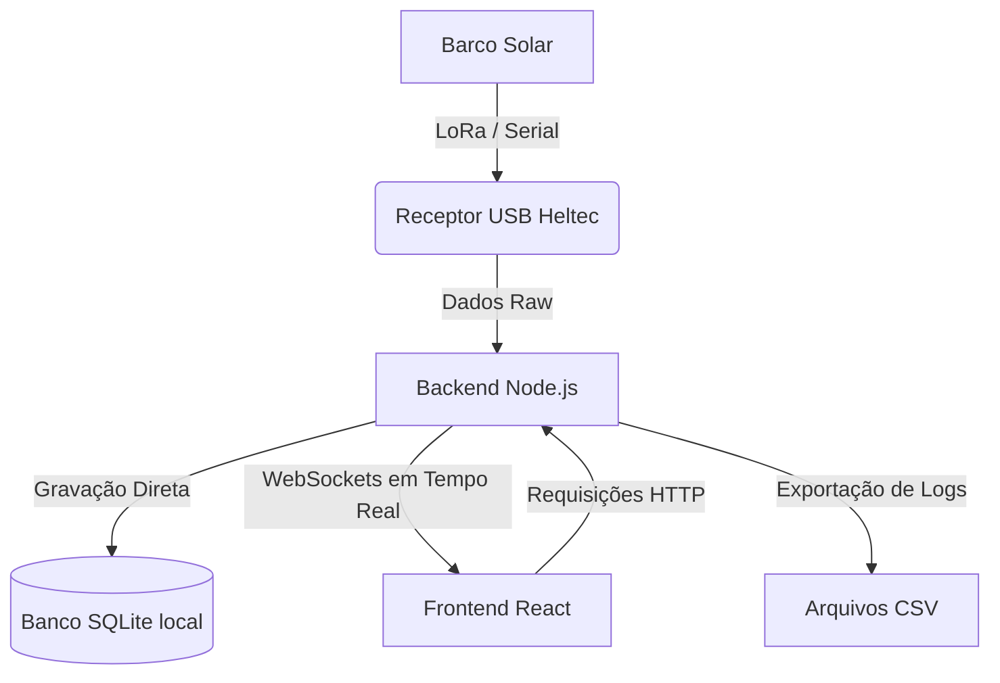

# Plano de Implementação: Estação Base Web Offline (Node.js + React + SQLite)

Este documento descreve a transição da aplicação atual (Flet/Python) para uma arquitetura Web offline moderna, robusta e multi-dispositivo, ideal para o ambiente de pista da equipe Leviatã.

---

## 🏗️ Nova Arquitetura do Sistema

O sistema funcionará **100% offline** na pista, rodando localmente no notebook do box. Outros dispositivos (celulares/tablets) poderão visualizar os dados conectando-se ao Wi-Fi local do box e acessando o IP do notebook.

---

## 🛠️ Tecnologias Propostas

### 🟢 Backend (Node.js)
- **Runtime:** Node.js (com TypeScript ou JavaScript puro, para simplicidade).
- **Leitura Serial:** `@serialport/stream` e `serialport` para interfacear com o receptor USB LoRa.
- **Banco de Dados:** `better-sqlite3` ou `sqlite3` (armazenamento leve em um único arquivo local `.db`).
- **WebSockets:** `socket.io` (gerenciamento fácil de conexões e reconexões automáticas).
- **Servidor HTTP:** `express` (para servir rotas de controle e exportação de CSV).

### 🔵 Frontend (React)
- **Build Tool:** Vite (rápido, leve e moderno).
- **Estilização:** CSS Vanilla ou Tailwind CSS + componentes modernos.
- **Gráficos em tempo real:** `ApexCharts` ou `Chart.js` (com renderização em Canvas de alta performance).
- **Mapas:** `React-Leaflet` (OpenStreetMap offline com cache de tiles/imagens do mapa local da raia).
- **WebSockets:** `socket.io-client` para receber os dados com baixa latência.

---

## 🗄️ Modelagem do Banco de Dados (SQLite)

### Tabela `sessoes`
Guarda cada sessão de teste ou corrida de forma isolada.
- `id` (INTEGER PRIMARY KEY AUTOINCREMENT)
- `nome` (TEXT - ex: "Treino Livre 1 - Lagoa")
- `criado_em` (DATETIME DEFAULT CURRENT_TIMESTAMP)

### Tabela `registros_telemetria`
Armazena as métricas recebidas do barco em tempo real.
- `id` (INTEGER PRIMARY KEY AUTOINCREMENT)
- `sessao_id` (INTEGER, FOREIGN KEY referenciando `sessoes(id)`)
- `timestamp` (DATETIME DEFAULT CURRENT_TIMESTAMP)
- **Energia:** `tensao_bat` (REAL), `corrente_bat` (REAL), `soc` (INTEGER), `tensao_solar` (REAL), `corrente_solar` (REAL), `pot_solar` (REAL)
- **Propulsão:** `rpm` (INTEGER), `temp_motor` (REAL), `temp_ctrl` (REAL), `fardriver_falha` (INTEGER)
- **Navegação:** `velocidade` (REAL), `latitude` (REAL), `longitude` (REAL), `proa` (REAL), `gps_satelites` (INTEGER)
- **Sinal:** `sinal_lora` (INTEGER), `sinal_lte` (INTEGER)

---

## 🚀 Passos da Implementação

### Fase 1: Configuração do Ambiente e Backend Node.js
1. Criar a estrutura de diretórios (`backend/` e `frontend/`).
2. Configurar o projeto Node.js e instalar dependências (`serialport`, `express`, `socket.io`, `sqlite3`).
3. Criar o módulo de banco de dados SQLite para criar as tabelas e expor funções de inserção e busca.
4. Criar o serviço de leitura serial que escuta a porta COM/USB e grava os dados recebidos no banco.
5. Adicionar a transmissão instantânea via WebSocket para todos os clientes conectados.
6. Criar uma rota HTTP `/api/exportar-csv?sessao_id=X` que consulta o banco e gera o download do arquivo CSV correspondente.

### Fase 2: Desenvolvimento do Frontend React
1. Inicializar o app React com Vite.
2. Criar a conexão WebSocket para receber os dados em tempo real.
3. Desenvolver o painel principal (Dashboard) com:
   - Indicadores numéricos (Velocidade, SoC, Correntes).
   - LEDs e alertas de segurança (temperatura alta, falha no Fardriver).
   - Gráficos de linha de histórico (corrente, potência solar, velocidade).
   - Mapa interativo rastreando a rota do barco.
4. Desenvolver tela de gerenciamento de sessões com lista de treinos passados e botão de exportar para CSV.

### Fase 3: Integração e Simulação
1. Adaptar o script do simulador existente (`simulador_dados.py` ou criar um em Node.js) para enviar dados de teste para a porta serial virtual ou direto para o backend.
2. Validar o salvamento no banco de dados e a integridade da exportação de CSV.
3. Testar o comportamento offline e o acesso via múltiplos dispositivos (PC e Celular conectados na mesma rede).

---

## ❓ Perguntas Abertas / Decisões da Equipe
- **Tailwind CSS:** Vocês preferem que a estilização do React use CSS Vanilla ou Tailwind CSS? (Tailwind acelera a criação de layouts responsivos, mas exige que definamos a versão ou tenhamos suporte a ele).
- **Porta Serial:** Vocês possuem um utilitário de portas seriais virtuais (como com0com no Windows) para podermos testar a leitura serial no Node.js localmente durante o desenvolvimento?
