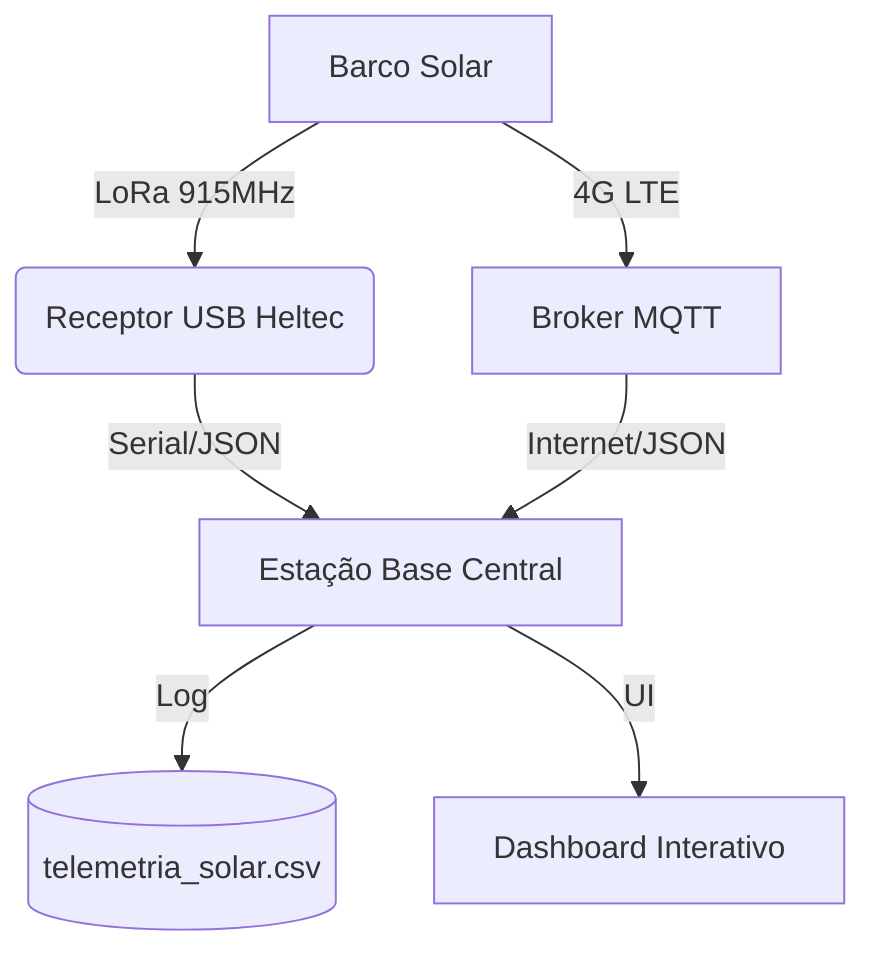

# 🚤 Telemetria Leviatã v2026 — Estação Base Central


A **Estação Base Central** é o coração do sistema de monitoramento da equipe **Leviatã**. Desenvolvida em Python com o framework **Flet**, ela centraliza dados provenientes de múltiplas fontes (Rádio LoRa e Nuvem MQTT/LTE), fornecendo uma interface de alta performance para tomada de decisão tática em tempo real durante competições de barcos solares.

---

## 🏗️ Arquitetura do Sistema

O sistema opera em uma configuração de redundância dual-link:



1.  **Link Primário (LoRa):** Comunicação direta via rádio, independente de internet.
2.  **Link Secundário (LTE/MQTT):** Backup via rede celular para cobertura estendida.
3.  **Processamento:** O backend unifica as fontes, remove duplicatas e faz o log persistente.

---

## 📊 Funcionalidades Principais

### 🛰️ Navegação & Posicionamento
- **Mapa em Tempo Real:** Visualização da trajetória com centralização automática.
- **Métricas Críticas:** Velocidade (Km/h e Nós), Satélites detectados, **Proa (Heading)** e precisão **HDOP**.

### 🔋 Gestão de Energia (BMS & MPPT)
- **Estado de Carga (SoC %):** Acompanhamento preciso do nível da bateria.
- **Balanço Energético:** Monitoramento de corrente líquida (carga solar vs. consumo motor).
- **Predição de Autonomia:** Algoritmo dinâmico que estima tempo e distância restantes.

### ⚙️ Diagnóstico da Propulsão
- **Fardriver Integration:** Decodificação em tempo real dos 15 códigos de falha do controlador.
- **Térmico:** Monitoramento de temperatura do motor e do controlador com alertas visuais.

### 📈 Análise de Dados
- **Gráficos Dinâmicos:** Histórico de 200 pontos para Velocidade, Potência Solar, Corrente do Motor e Bateria.
- **Logs:** Gravação automática de cada pacote recebido em formato `.csv` para análise pós-prova.

---

## 📂 Estrutura do Projeto

- `main.py`: Ponto de entrada da aplicação.
- `dashboard.py`: Lógica da interface, gerenciamento de estados e threads de comunicação.
- `backend.py`: Motor de processamento de dados e escrita de logs CSV.
- `ui_components.py`: Biblioteca de widgets customizados (Cards, Badges, LEDs).
- `config.py`: Central de configurações (Portas, Broker, Cores, Parâmetros do Barco).
- `simulador_dados.py`: Utilitário para testar a interface sem hardware físico.

---

## 🚀 Guia de Instalação

### Pré-requisitos
- Python 3.10 ou superior instalado.

### 1. Clonar e Preparar Ambiente
```powershell
# Criar ambiente virtual
python -m venv .venv

# Ativar ambiente (Windows)
.\.venv\Scripts\activate

# Instalar dependências
pip install flet pyserial paho-mqtt flet-charts flet-map
```

### 2. Configuração
Edite o arquivo `config.py` para ajustar as portas seriais e endereços do broker conforme necessário:
```python
SERIAL_PORT = "COM3"
MQTT_TOPIC = "leviata/telemetria/race"
```

### 3. Execução
```powershell
python main.py
```

---

## 📡 Protocolo de Dados (JSON)

O sistema espera o seguinte formato de payload:

```json
{
  "solar": {"tensao": 46.5, "corrente": 5.9, "pot": 277},
  "bateria": {"soc": 85, "tensao_bat": 50.7, "corrente_liq": -10.6},
  "prop": {"rpm": 1314, "i_motor": 16.6, "t_motor": 54, "t_ctrl": 37, "fardriver_falha": 0},
  "nav": {"vel": 19.7, "lat": -3.1194, "lon": -60.0216, "gps_satelites": 10, "gps_hora": "12:00:00", "proa": 184.8, "hdop": 0.8},
  "sinal": {"lora_pacotes": 125, "lora": -83, "lte": 29},
  "v_sist": 4.1
}
```

---

## 🛠️ Desenvolvimento e Testes

Para testar a interface sem um rádio conectado:
1. Execute o script de simulação: `python simulador_dados.py`
2. Copie o JSON gerado e utilize ferramentas de injeção serial ou publique no broker MQTT configurado.

---

## 📦 Compilação (.exe)

Para gerar o executável stand-alone para Windows:

```powershell
python -m PyInstaller --noconsole --onefile --collect-all flet --collect-all flet_charts --collect-all flet_map --name "Telemetria_Leviata_2026" --icon="seu_icone.ico" main.py
```

---

## ❓ Solução de Problemas (FAQ)

**1. A porta Serial não abre:**
- Verifique se o driver da Heltec/ESP32 está instalado.
- Certifique-se de que nenhum outro programa (como o Arduino IDE) está usando a porta.

**2. O mapa não carrega:**
- Verifique sua conexão com a internet (necessária para carregar os tiles do OpenStreetMap).

**3. Dados MQTT não aparecem:**
- Verifique se o `MQTT_TOPIC` no `config.py` é exatamente o mesmo enviado pelo barco.
- Teste a conexão com o broker usando o [MQTT Explorer](http://mqtt-explorer.com/).

---
**Engenharia de Software:** Desenvolvido por Equipe Leviatã. Foco em robustez, baixa latência e UX crítica.
