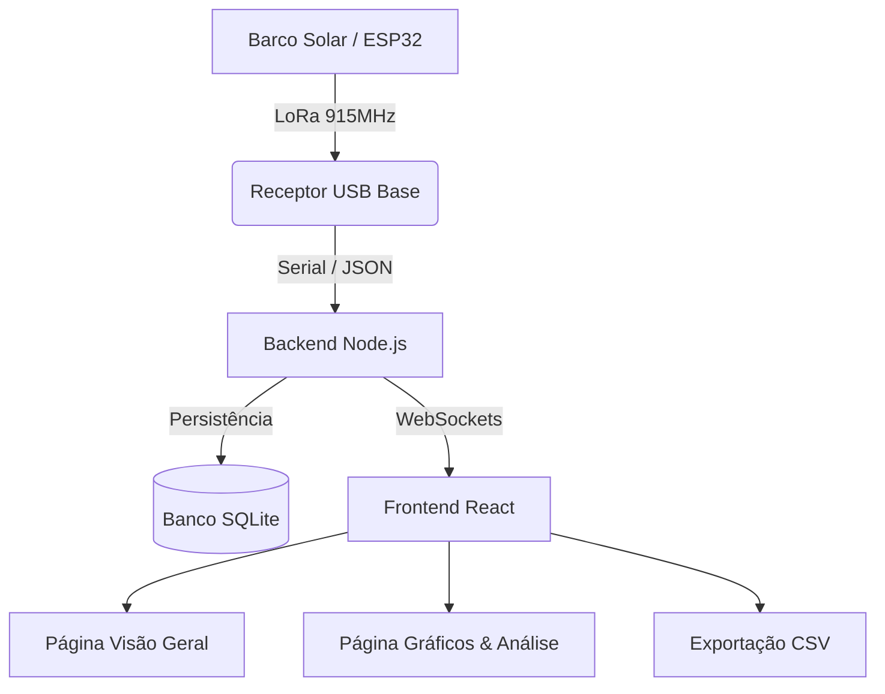

# 🚤 Telemetria Leviatã v2026 — Estação Base Central


A **Estação Base Central** é o sistema de monitoramento da equipe **Leviatã 2026**. Desenvolvida com **React 19**, **Vite** e **Node.js (Express + Socket.IO)**, a aplicação oferece um dashboard moderno em tempo real com **arquitetura multi-página**, suporte a **dispositivos móveis**, histórico em banco **SQLite** e telemetria via rádio **LoRa / Serial USB**.

---

## 🏗️ Arquitetura do Sistema



1. **Recepção de Rádio (LoRa 915MHz):** O rádio base recebe os pacotes de telemetria serial em formato JSON do barco.
2. **Backend Node.js (`backend-node`):**
   - Gerencia a conexão com a porta Serial USB (`serialport`).
   - Persiste cada registro no banco de dados **SQLite3** (`database.js`).
   - Transmite os dados em tempo real via **WebSockets (Socket.IO)** com baixa latência.
   - Fornece um simulador de telemetria integrado para testes sem hardware.
3. **Frontend React (`frontend-react`):**
   - **Visão Geral (Dashboard Principal):** Indicadores analógicos SVG (Velocidade, RPM, Solar), Mapa GPS com mapa escuro CartoDB, Cronômetro de Voltas (*Lap Timer*), Nível de bateria LiFePO4, Alertas de Segurança e Gráfico de Corrente em Amperes ($A$).
   - **Gráficos & Análise:** Histórico de séries temporais de Geração vs Consumo, Temperaturas (Motor/Ctrl) e Rotação.
   - **Responsividade:** Layout com rolagens ativas no celular/tablet.

---

## 📊 Funcionalidades Principais

### 🗺️ Navegação & Posicionamento GPS
- **Mapa em Tempo Real:** Renderização vetorial com camada escura nativa (CartoDB Dark Matter) e traçado de rota.
- **Telemetria de Voo:** Velocidade ($km/h$), Proa em Graus ($^\circ$), Quantidade de Satélites detectados e Horário GPS.

### 🔋 Gestão de Energia (LiFePO4 & MPPT)
- **Fluxo de Energia Integrado:** Visualização dinâmica da entrada solar ($W$) e do consumo do motor ($W$).
- **Indicador de Carga (SoC %):** Células visuais graduadas de 10% a 100% com alertas em zonas críticas.
- **Comparativo de Corrente em Amperes ($A$):** Gráfico unificado de Entrada Solar ($A$), Saída Motor ($A$) e Corrente Líquida Bateria ($A$) na mesma escala.
- **Predição de Autonomia:** Cálculo dinâmico do tempo restante em horas.

### ⚙️ Diagnóstico de Propulsão & Segurança
- **Decodificação de Erros FarDriver:** Monitoramento em tempo real dos códigos de falha do controlador.
- **Barras Térmicas de Segurança:** Indicadores com limites operacionais em $65^\circ C$ para motor e caixa eletrônica.
- **Indicador de Sinal LoRa:** Qualidade do sinal ($dBm$) e contagem de pacotes recebidos (`Pkts`).

### ⏱️ Cronômetro & Sessões de Prova
- **Pit Wall Lap Timer:** Marcação de voltas, estatísticas de velocidade máxima, velocidade média e melhor volta.
- **Gerenciador de Sessões:** Criação de sessões de prova e download do histórico completo em arquivo **CSV**.

---

## 📂 Estrutura do Projeto

```
estação base/
├── backend-node/               # Servidor Node.js (API & WebSockets)
│   ├── database.js             # Conexão e queries SQLite
│   ├── serialManager.js        # Leitura e detecção da porta Serial USB
│   ├── simulator.js            # Gerador de pacotes para simulação
│   └── server.js               # Ponto de entrada do servidor Express/Socket.IO
│
├── frontend-react/             # Aplicação React 19 (Vite)
│   ├── src/
│   │   ├── components/         # Widgets (BoatMap, CircularGauge, BatteryWidget, etc.)
│   │   ├── pages/              # Páginas (DashboardPage, AnalyticsPage)
│   │   ├── services/           # Conexão Socket.IO e chamadas REST API
│   │   ├── App.jsx             # Roteador principal e gerenciador de estado
│   │   └── index.css           # Sistema de design Cockpit e classes utilitárias
│   └── package.json
│
├── backend.py                  # Backend alternativo em Python (Legado)
└── dashboard.py                # Dashboard alternativo em Flet (Legado)
```

---

## 🚀 Guia de Instalação e Execução

### 🎒 Modo Portátil de Pista (1 Clique - Recomendado)
1. Navegue até a pasta `estação base` ou `estação base web`.
2. Dê **2 cliques** no arquivo executável:
   ```cmd
   START_TELEMETRIA.bat
   ```
3. O servidor abrirá automaticamente a interface em `http://localhost:3001` no seu navegador sem necessidade de instalar o Node.js.

---

### 💻 Modo de Desenvolvimento (NPM)

#### 1. Iniciar o Backend Node.js
```bash
cd "estação base web/backend-node"
npm install
node server.js
```
O backend rodará na porta `http://localhost:3001`.

#### 2. Iniciar o Frontend React (Vite Hot Reload)
```bash
cd "estação base web/frontend-react"
npm install
npm run dev
```
Acesse o dashboard pelo navegador no endereço `http://localhost:5173`.

---

## 📡 Protocolo de Dados (JSON)

O sistema espera o seguinte formato de payload via rádio LoRa / Serial:

```json
{
  "solar": { "tensao": 46.5, "corrente": 5.9, "pot": 277 },
  "bateria": { "soc": 85, "tensao_bat": 50.7, "corrente_liq": -10.6 },
  "prop": { "rpm": 1314, "i_motor": 16.6, "t_motor": 54, "t_ctrl": 37, "fardriver_falha": 0 },
  "nav": { "vel": 19.7, "lat": -3.1194, "lon": -60.0216, "gps_satelites": 10, "gps_hora": "12:00:00", "proa": 184.8, "hdop": 0.8 },
  "sinal": { "lora_pacotes": 125, "lora": -83, "lte": 29 },
  "v_sist": 4.1
}
```

---

## 🧪 Modo Simulação (Sem Hardware)

Para testar a interface sem um rádio conectado:
1. Abra o dashboard na web (`http://localhost:5173`).
2. Clique no botão **"Simular"** (Simulador ON) no cabeçalho superior.
3. O backend começará a gerar dados de navegação, telemetria e bateria dinamicamente.

---

**Engenharia de Software:** Desenvolvido por Equipe Leviatã. Foco em alta disponibilidade, inteligência tática e UX em tempo real.
