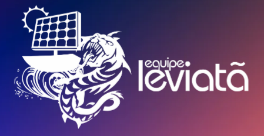

# Projeto Leviatã - Telemetria ⛵🔋



Este repositório centraliza o desenvolvimento dos sistemas de telemetria da **Equipe Leviatã (UEA)**. O foco é o monitoramento em tempo real, coleta e análise de dados para embarcações movidas a energia solar, integrando hardware de baixo custo e alta eficiência.

O sistema permite acompanhar parâmetros críticos de performance, garantindo segurança e eficiência durante as competições, como o **Desafio Solar Brasil**.

## 📋 Estrutura do Repositório

O projeto está organizado por ciclos de desenvolvimento e tecnologias específicas:

* **`TELEMETRIA 2025`**: Desenvolvimento atual focado em novas tecnologias de comunicação.
* **`telemetria_2024-2025` / `2023-2024`**: Histórico de códigos e implementações utilizadas em competições anteriores.
* **`BMV-Victron Energy`**: Integração com monitores de bateria profissionais para leitura de SoC (State of Charge), tensão e corrente.
* **`PAIC`**: Pesquisa acadêmica sobre a avaliação de tecnologias de comunicação sem fio (LoRa, WiFi, etc) aplicadas ao contexto naval solar.
* **`bibliotecas`**: Dependências específicas e drivers utilizados nos projetos de hardware.

## 🚀 Tecnologias e Hardware

O projeto utiliza uma combinação de protocolos e dispositivos para garantir a entrega dos dados:

* **Microcontroladores:** ESP32, Arduino.
* **Comunicação:** Módulos LoRa32, SIM7000G (LTE/NB-IoT), Bluetooth e WiFi.
* **Protocolos:** MQTT para transmissão via broker, serial para sensores.
* **Linguagens:** C++ (Arduino Framework), C e Python para processamento de dados.

## 🛠️ Funcionalidades Principais

- [x] Monitoramento de baterias de Lítio e consumo energético.
- [x] Transmissão de dados de longa distância via LoRa.
- [x] Integração com sensores de telemetria para velocidade e posicionamento.
- [x] Armazenamento e visualização de dados em tempo real.

## 📦 Como usar

1.  **Clone o repositório:**
    ```bash
    git clone [https://github.com/eliasdopontiac/telemetria-leviata.git](https://github.com/eliasdopontiac/telemetria-leviata.git)
    ```
2.  **Instale as bibliotecas:** As bibliotecas necessárias estão na pasta `/bibliotecas`. Certifique-se de adicioná-las ao seu ambiente de desenvolvimento (Arduino IDE ou PlatformIO).
3.  **Configuração:** Verifique os arquivos de configuração nos diretórios de cada ano para ajustar as credenciais de rede ou parâmetros dos sensores.

## 👥 Contato

**Elias Cunha** - *Electrical Lead na Equipe Leviatã*
* Instagram: [@leviatauea](https://www.instagram.com/leviatauea/)
* Email: ehlc.eai22@uea.edu.br

---
Desenvolvido com foco em inovação e sustentabilidade na Amazônia. 🌿