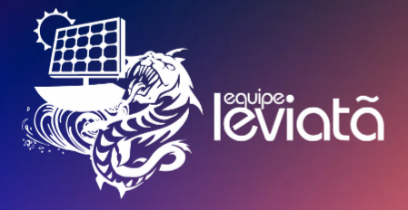

# 🌊 Projeto Leviatã — Sistema de Telemetria

<div align="center">



[](https://www.instagram.com/leviatauea/)
[]()
[]()
[]()

</div>

> Repositório oficial do sistema de telemetria da **Equipe Leviatã (UEA)** — monitoramento em tempo real, aquisição e análise de dados para embarcações movidas a energia solar, com foco em competições como o **Desafio Solar Brasil**.

---

## 📑 Índice

- [Sobre o Projeto](#-sobre-o-projeto)
- [Estrutura do Repositório](#-estrutura-do-repositório)
- [Histórico de Temporadas](#-histórico-de-temporadas)
- [Telemetria 2026 — Fardriver Pro](#-telemetria-2026--fardriver-pro)
- [Telemetria 2025 — LoRa & BMV](#-telemetria-2025--lora--bmv)
- [Telemetria 2024-2025](#-telemetria-2024-2025)
- [Telemetria 2023-2024](#-telemetria-2023-2024)
- [BMV — Victron Energy](#-bmv--victron-energy)
- [PAIC — Pesquisa Acadêmica](#-paic--pesquisa-acadêmica)
- [Bibliotecas e Dependências](#-bibliotecas-e-dependências)
- [Hardware e Tecnologias](#-hardware-e-tecnologias)
- [Como Usar](#-como-usar)
- [Contato](#-contato)

---

## 🚤 Sobre o Projeto

A **Equipe Leviatã** da Universidade do Estado do Amazonas (UEA) desenvolve tecnologias voltadas à **mobilidade sustentável**, projetando e construindo embarcações movidas inteiramente a energia solar para competir no **Desafio Solar Brasil**.

Este repositório centraliza **todo o ecossistema de software de telemetria** da equipe, cobrindo desde os primeiros experimentos com NodeMCU e Blynk até o sistema moderno de aquisição de dados do controlador de motor **Fardriver**, com interface gráfica em tempo real e geração de relatórios de engenharia.

O sistema de telemetria permite:
- Acompanhar parâmetros críticos de **performance e segurança** em tempo real;
- Comunicar dados entre a embarcação e a equipe de apoio em terra;
- Registrar e analisar o histórico de operação para otimização da estratégia de corrida;
- Diagnosticar falhas de hardware durante testes e competições.

---

## 📁 Estrutura do Repositório

```
telemetria-leviata/
│
├── Telemetria_2026/            # ⭐ Temporada atual: Fardriver Pro (Python + PyQt5)
├── TELEMETRIA 2025/            # LoRa ponto-a-ponto e integração BMV
├── telemetria_2024-2025/       # BMV, MPPT e GPS com Blynk
├── telemetria_2023-2024/       # Módulos experimentais: CAN, LoRa, ESP-NOW, GPS...
├── BMV-Victron Energy/         # Leitura serial do SmartShunt via ESP32
├── PAIC/                       # Pesquisa acadêmica em comunicação sem fio
├── bibliotecas/                # Bibliotecas Arduino locais (drivers e dependências)
└── images/                     # Assets gráficos do projeto
```

---

## 📅 Histórico de Temporadas

| Temporada | Pasta | Tecnologia Principal | Status |
|-----------|-------|----------------------|--------|
| 2023-2024 | `telemetria_2023-2024/` | CAN Bus, LoRa, ESP-NOW, Blynk | ✅ Concluída |
| 2024-2025 | `telemetria_2024-2025/` | BMV + MPPT + GPS via Blynk | ✅ Concluída |
| 2025 | `TELEMETRIA 2025/` | LoRa ponto-a-ponto, BMV serial | ✅ Concluída |
| 2026 | `Telemetria_2026/` | Fardriver Serial, PyQt5, Relatórios HTML | 🚧 Em andamento |

---

## ⚡ Telemetria 2026 — Fardriver Pro

A temporada 2026 representa a maior evolução do sistema: uma **aplicação desktop completa** para comunicação com o controlador de motor **Fardriver (ND72450)** via protocolo serial proprietário.

### 🏗️ Arquitetura do Sistema

```
Controlador Fardriver (Motor BLDC)
        │
        │ UART Serial @ 19200 bps
        │
  Adaptador USB-TTL
        │
  Aplicação Python
        │
 ├── fardriver_serial.py   → Comunicação UART / Keep-Alive / Checksum CRC16
 ├── heb_parser.py         → Decodificador de backups .HEB (Fardriver)
 ├── report_generator.py   → Gerador de relatório HTML com Chart.js
 └── ui_dashboard.py       → Interface gráfica PyQt5 + PyQtGraph (10 Hz)
```

### 📊 Dashboard em Tempo Real

A aplicação conta com uma **interface gráfica de alto desempenho** capaz de:
- Gravar até **1 hora de dados contínuos em memória RAM** sem travamentos;
- Exibir gráficos com **janela deslizante** atualizados a **10 Hz**;
- Monitorar: **RPM, Corrente de Linha, Tensão, Temperatura do Motor e da Controladora, Potência e Erros de Falha**.

### 📄 Relatórios Offline de Engenharia

Com um clique, os dados do teste são exportados para um **documento HTML interativo** (via Chart.js) exibindo:
- Picos absolutos de **Corrente e RPM**;
- Médias e picos de **Temperatura** (Motor e MOSFET);
- Gráficos trifásicos de **RPM, Amperes e Volts** separados para análise de desempenho.

### 📡 Protocolo Fardriver

O protocolo de comunicação segue a estrutura:

```
Header (0xAA) → Comando/Endereço → Payload → CRC16 → Not-Checksum
```

A integridade dos pacotes é garantida por **tabela CRC16** implementada conforme o manual oficial do controlador.

### 🛠️ Funcionalidades (2026)

- [x] Leitura ao vivo de **RPM, Corrente, Tensão e Potência**
- [x] Monitoramento térmico (**Motor e MOSFET**)
- [x] Gráficos com **janela deslizante** e histórico de 1 hora
- [x] Gerador de **Relatório HTML** (exportável em PDF pelo navegador)
- [x] Ajuste e envio de parâmetros (**Corrente, Polos, Throttle, WeakA**)
- [x] Comandos de manutenção (**Auto-Learn e Factory Reset**)
- [x] Leitura de arquivos de backup **`.HEB`** da Fardriver
- [x] Detecção e exibição de **códigos de erro** (15 falhas catalogadas)
- [x] Geração de executável standalone via **PyInstaller**

### ⚙️ Tecnologias (2026)

| Componente | Tecnologia |
|---|---|
| Linguagem | Python 3.8+ |
| Interface Gráfica | PyQt5 / CustomTkinter |
| Gráficos em Tempo Real | PyQtGraph |
| Gráficos de Relatório | Chart.js (HTML) |
| Comunicação Serial | PySerial |
| Empacotamento | PyInstaller |

### 🔌 Conexão com o Controlador

Use um adaptador **USB-TTL (RS485/UART)**. O cruzamento dos fios é obrigatório:

```
TX (Fardriver)  →  RX (PC)
RX (Fardriver)  →  TX (PC)
GND (Fardriver) →  GND (PC)
```

---

## 📡 Telemetria 2025 — LoRa & BMV

Foco em comunicação de **longa distância** entre embarcação e base em terra, além de integração aprofundada com o monitor de bateria Victron.

### Módulos

| Pasta | Descrição |
|---|---|
| `telemetria com lora/lora-sender` | Firmware do ESP32 embarcado — coleta e transmite dados via LoRa |
| `telemetria com lora/lora-receiver` | Firmware da estação base — recebe e exibe dados via LoRa |
| `telemetria-bmv` | Leitura do protocolo VE.Direct do SmartShunt Victron via ESP32 |

---

## 🔋 Telemetria 2024-2025

Integração de múltiplos sensores com a plataforma **Blynk IoT** para monitoramento remoto via aplicativo mobile.

| Pasta | Sensor / Dispositivo | Parâmetros Monitorados |
|---|---|---|
| `bmv-blynk` | Victron SmartShunt | SoC (%), Tensão (V), Corrente (A) |
| `mptt-blynk` | Controlador MPPT | Tensão painel, corrente de carga |
| `shunt-gps-blynk` | Shunt + GPS | Localização, velocidade, consumo |

---

## 🧪 Telemetria 2023-2024

Fase de **experimentação e prototipagem** com ampla variedade de tecnologias. Cada pasta representa um módulo ou experimento independente.

<details>
<summary>Ver todos os módulos (clique para expandir)</summary>

| Módulo | Descrição |
|---|---|
| `ACIONAMENTOS_PAINEL` | Controle de acionamentos via painel físico |
| `ACIONAMENTOS_RELAY` | Controle de relés via ESP32 |
| `BLYNK_GPS_NODEMCU` | GPS integrado ao Blynk com NodeMCU |
| `BLYNK_IR` | Controle via infravermelho com Blynk |
| `CAN-GPS-MPPT` | Barramento CAN com dados de GPS e MPPT |
| `CAN_ESP32` / `CAN_ESP32_PT2` | Comunicação CAN Bus no ESP32 |
| `DISPLAY_FDP_ESP32/NODEMCU` | Display para dados do controlador de motor |
| `ESP_NOW_RECEIVER/SEND` | Comunicação ponto-a-ponto ESP-NOW (sem roteador) |
| `LORA` / `TESTE DO LORA` | Experimentos com módulos LoRa32 |
| `MPPT_DADOS` | Leitura de dados do controlador MPPT |
| `SD_CARD` | Armazenamento local de dados em cartão SD |
| `SENSOR_DE_CORRENTE_ARDUINO` | Sensor de corrente com Arduino |
| `Sensor_Efeito_Hall` | Sensor de efeito Hall para velocidade/RPM |
| `TELEMETRIA V2 → V5` | Versões evolutivas do sistema de telemetria |
| `VOLTIMETRO_5V/12V/48V` | Medição de tensão para diferentes barramentos |
| `WIFI_LED_CONTROL` | Controle via WiFi |
| `gps_drone_ESP32` | GPS com ESP32 para rastreamento |
| `tacometro` | Tacômetro digital |

</details>

---

## 🔋 BMV — Victron Energy

Pasta dedicada à integração com o **Victron SmartShunt** — monitor de bateria profissional da série BMV.

- **Arquivo:** `smartshunt_pteste_esp.ino`
- **Protocolo:** VE.Direct (serial assíncrono)
- **Dados lidos:** Tensão, Corrente, SoC (State of Charge), Potência
- **Microcontrolador:** ESP32

---

## 🎓 PAIC — Pesquisa Acadêmica

**Programa de Aprendizagem e Iniciação Científica** da UEA voltado à avaliação de tecnologias de comunicação sem fio para embarcações solares.

> **Título:** *Avaliação de tecnologias de comunicação sem-fio para embarcação movida a energia solar*

A pesquisa compara tecnologias como **LoRa, WiFi, Bluetooth e LTE/NB-IoT (SIM7000G)** em critérios de:
- Alcance e confiabilidade do link;
- Consumo energético;
- Latência e taxa de transferência;
- Adequação ao ambiente aquático/competitivo.

---

## 📦 Bibliotecas e Dependências

As bibliotecas abaixo estão incluídas localmente na pasta `bibliotecas/` para garantir compatibilidade e reprodutibilidade dos projetos Arduino/ESP32:

| Biblioteca | Uso |
|---|---|
| `107-Arduino-MCP2515` | Comunicação CAN Bus via MCP2515 |
| `ArduinoBLE` | Bluetooth Low Energy para ESP32/Arduino |
| `ArduinoJson` | Serialização/deserialização de JSON |
| `Blynk` / `BlynkNcpDriver` | Plataforma IoT Blynk |
| `DabbleESP32` | Interface mobile via Bluetooth |
| `ESP32Servo` | Controle de servomotores com ESP32 |
| `EmonLib` | Monitoramento de energia elétrica |
| `EspSoftwareSerial` | Serial por software no ESP32 |
| `Firebase_ESP32_Client` | Integração com Firebase Realtime Database |
| `VeDirectFrameHandler` | Decodificação do protocolo VE.Direct (Victron) |
| `autowp-mcp2515` | Driver alternativo para CAN Bus MCP2515 |

---

## 🔧 Hardware e Tecnologias

### Microcontroladores

| Hardware | Aplicação |
|---|---|
| **ESP32** | Plataforma principal — WiFi, BT, LoRa, CAN, Serial |
| **Arduino** | Prototipagem e leitura de sensores analógicos |
| **NodeMCU (ESP8266)** | Comunicação WiFi e Blynk (temporadas anteriores) |

### Comunicação

| Tecnologia | Módulo | Uso |
|---|---|---|
| LoRa | LoRa32 (Heltec / TTGO) | Telemetria de longa distância (>1 km) |
| LTE / NB-IoT | SIM7000G | Cobertura celular em competições |
| WiFi | ESP32 interno | Rede local e Blynk |
| Bluetooth / BLE | ESP32 interno | Configuração e debug próximo |
| CAN Bus | MCP2515 | Comunicação com controladores de motor |
| UART / Serial | USB-TTL | Leitura de Fardriver e Victron (VE.Direct) |
| ESP-NOW | ESP32 interno | Link direto sem roteador, baixa latência |

### Protocolos e Plataformas

| Protocolo / Plataforma | Descrição |
|---|---|
| **MQTT** | Transmissão de telemetria via broker na nuvem |
| **Blynk IoT** | Dashboards mobile para monitoramento remoto |
| **VE.Direct** | Protocolo proprietário Victron Energy |
| **Fardriver Serial** | Protocolo proprietário do controlador ND72450 |
| **Firebase** | Armazenamento e sincronização de dados em nuvem |

---

## 🚀 Como Usar

### Projetos Arduino/ESP32 (C++)

1. **Clone o repositório:**
   ```bash
   git clone https://github.com/eliasdopontiac/telemetria-leviata.git
   ```

2. **Adicione as bibliotecas:** Copie as pastas de `bibliotecas/` para o diretório de bibliotecas do Arduino IDE:
   - Windows: `Documentos/Arduino/libraries/`
   - Linux/macOS: `~/Arduino/libraries/`

3. **Abra o projeto:** Navegue até a pasta do módulo desejado e abra o arquivo `.ino` na Arduino IDE ou PlatformIO.

4. **Configure os parâmetros:** Ajuste credenciais de rede, tokens Blynk, baudrate e pinos conforme o seu hardware no topo de cada sketch.

---

### Aplicação Python — Fardriver Pro (2026)

1. **Instale as dependências:**
   ```bash
   pip install pyserial PyQt5 pyqtgraph pyinstaller
   ```

2. **Execute em modo desenvolvimento:**
   ```bash
   cd Telemetria_2026/Fardriver_pro
   python main.py
   ```

3. **Gere o executável standalone:**
   ```bash
   pyinstaller --noconsole --onefile --add-data "logo.png;." main.py
   ```
   O executável será gerado em `Telemetria_2026/Fardriver_pro/dist/`.

---

## 👥 Contato

**Elias Cunha** — *Electrical Lead · Equipe Leviatã (UEA)*

[](https://www.instagram.com/leviatauea/)
[](mailto:ehlc.eai22@uea.edu.br)

---

<div align="center">

Desenvolvido com 💚 foco em **engenharia, inovação e sustentabilidade** na Amazônia.

**Equipe Leviatã · Universidade do Estado do Amazonas (UEA)**

</div>